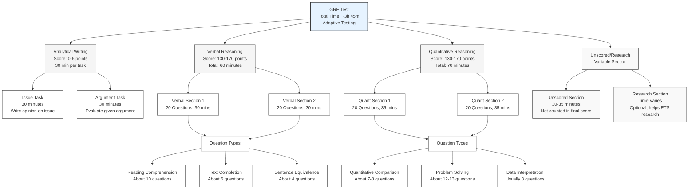
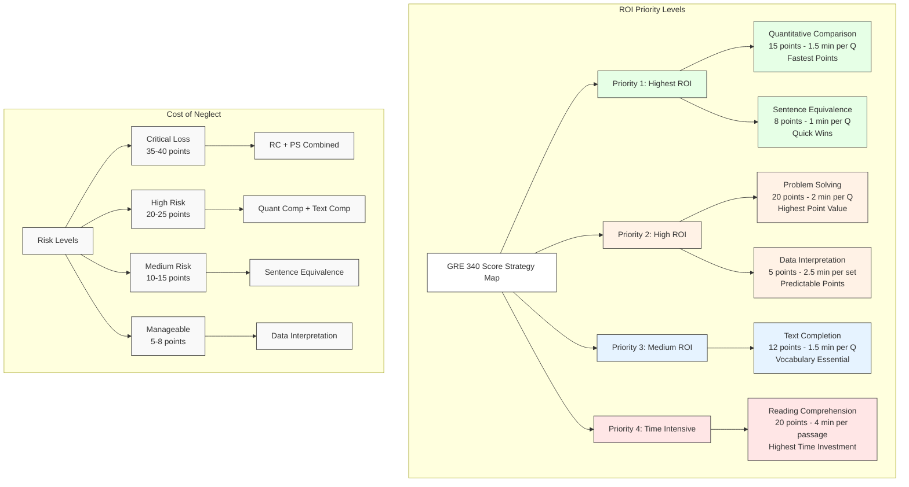

# GRE Test Preparation Strategy Guide

This repository contains detailed visual guides for understanding the GRE test structure and optimal preparation strategy based on Return on Investment (ROI) analysis.

## Table of Contents
- [Test Structure Overview](#test-structure-overview)
- [ROI Strategy](#roi-strategy)

## Test Structure Overview

The first diagram provides a comprehensive breakdown of the GRE test structure, including:
- Total test duration: ~3 hours 45 minutes
- All major sections and their scoring ranges
- Question distribution across sections
- Time allocation per section
- Types of questions in each section

### Key Components
1. **Analytical Writing (0-6 points)**
   - Issue Task (30 minutes)
   - Argument Task (30 minutes)

2. **Verbal Reasoning (130-170 points)**
   - Two 30-minute sections
   - 20 questions per section
   - Question types: Reading Comprehension, Text Completion, Sentence Equivalence

3. **Quantitative Reasoning (130-170 points)**
   - Two 35-minute sections
   - 20 questions per section
   - Question types: Quantitative Comparison, Problem Solving, Data Interpretation

4. **Unscored/Research Section**
   - Variable timing
   - Does not count toward final score

## ROI Strategy

The second diagram presents a strategic approach based on ROI analysis, highlighting:

### Priority Levels

1. **Highest ROI (Priority 1)**
   - Quantitative Comparison (15 points, 1.5 min/question)
   - Sentence Equivalence (8 points, 1 min/question)

2. **High ROI (Priority 2)**
   - Problem Solving (20 points, 2 min/question)
   - Data Interpretation (5 points, 2.5 min/set)

3. **Medium ROI (Priority 3)**
   - Text Completion (12 points, 1.5 min/question)

4. **Time Intensive (Priority 4)**
   - Reading Comprehension (20 points, 4 min/passage)

### Cost of Neglect Analysis
- **Critical Loss (35-40 points)**: Reading Comprehension + Problem Solving
- **High Risk (20-25 points)**: Quantitative Comparison + Text Completion
- **Medium Risk (10-15 points)**: Sentence Equivalence
- **Manageable (5-8 points)**: Data Interpretation

## Strategic Recommendations

1. **Initial Focus**
   - Master Quantitative Comparison techniques
   - Build strong vocabulary for Sentence Equivalence
   - Develop efficient Reading Comprehension strategies

2. **Time Investment**
   - Allocate more practice time to high-point sections
   - Practice time management for Reading Comprehension
   - Develop quick solving strategies for Priority 1 questions

3. **Practice Approach**
   - Use official ETS materials for authentic practice
   - Take full-length practice tests to build stamina
   - Focus on understanding error patterns

4. **Score Maximization**
   - Target perfect scores in Priority 1 sections first
   - Gradually build speed in time-intensive sections
   - Maintain balance between speed and accuracy

## Using This Guide

1. Use the test structure diagram to understand the overall format and requirements
2. Follow the ROI strategy to prioritize your preparation
3. Pay special attention to the "Cost of Neglect" analysis
4. Adjust your study plan based on your current strengths and weaknesses

## Contributing

Feel free to contribute to this repository by:
- Adding study resources
- Sharing preparation strategies
- Suggesting improvements to the diagrams
- Reporting errors or updates

## License

This resource is available under the MIT License. Feel free to use and modify with attribution.

---
*Note: These diagrams and strategies are based on the current GRE test format as of 2024. Always verify the latest test format and requirements on the official ETS website.*

## ROI Strategy
